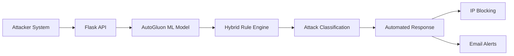

<div align="center">

# AI-Powered Intrusion Detection & Automated Response System


A hybrid AI-based Intrusion Detection System with real-time automated threat response.

</div>
<p align="center">
  
</p>

---

## Overview

This system combines **Machine Learning** (AutoGluon) with **Rule-Based Behavioral Analysis** to detect and mitigate cyber attacks in real time. Network traffic is classified into attack types, and automated responses — IP blocking and email alerts — are triggered based on severity.

**Key capabilities:**
- Real-time attack classification using the NSL-KDD dataset
- Hybrid detection: ML model + rule-based logic
- Automated IP blocking and Gmail SMTP alerts
- Two-machine setup: Ubuntu VM (victim) + Windows (attacker)

---

## Architecture



---

## Tech Stack

| Technology | Role |
|---|---|
| Python 3.10 | Core language |
| AutoGluon | ML / AutoML model |
| Flask | REST API server |
| Pandas / NumPy | Data processing |
| Gmail SMTP | Email alert system |
| VirtualBox | Ubuntu VM |
| NSL-KDD Dataset | Training & testing data |

---

## Project Structure

```
AI-Intrusion-Detection-and-Response-System/
├── AutoGluon_IDS_Model_4Class/   # Trained ML model
├── attacker_send_csv.py          # Attack simulation (Windows)
├── victim_server.py              # Flask IDS server (Ubuntu VM)
├── train.csv
├── test.csv
├── requirements.txt
└── .gitignore
```

---

## Setup & Installation

### Prerequisites

| System | Requirements |
|---|---|
| Windows Host | Python 3.10+, Anaconda, VirtualBox |
| Ubuntu VM | Ubuntu 22.04+, Python 3.10+ |

### 1. VirtualBox Network — Important

The Ubuntu VM **must** use **Bridged Adapter** mode so both machines share the same network.

> VirtualBox → Settings → Network → Adapter 1 → Attached To: **Bridged Adapter**

### 2. Clone the Repository

```bash
git clone https://github.com/your-username/AI-Intrusion-Detection-and-Automated-Response-System.git
cd AI-Intrusion-Detection-and-Automated-Response-System
```

### 3. Windows — Create Conda Environment

```bash
conda create -n ids312 python=3.10 -y
conda activate ids312
pip install -r requirements.txt
```

### 4. Ubuntu VM — Install Dependencies

```bash
sudo apt update && sudo apt install python3-pip -y
pip install flask pandas numpy requests autogluon
```

### 5. Find Ubuntu VM IP

```bash
ip addr   # Look for: inet 192.x.x.x
```

Update `attacker_send_csv.py` with that IP:

```python
TARGET = "http://192.168.x.x:5000/predict"
```

---

## Running the System

**Step 1 — Start the victim server (Ubuntu VM)**

```bash
python3 victim_server.py
```

**Step 2 — Launch an attack simulation (Windows)**

```bash
conda activate ids312

python attacker_send_csv.py dos    # DoS attack
python attacker_send_csv.py r2l    # Remote to Local
python attacker_send_csv.py u2r    # User to Root
```

**Sample output:**

```
[+] Hybrid AI IDS + Response System Started

[12:45:31] 192.168.1.100 → DoS  | Blocked 60s
[12:46:02] 192.168.1.101 → R2L  | Alert Only
[12:46:44] 192.168.1.102 → U2R  | Critical Block
```

---

## Attack Types & Responses

| Attack | Description | Automated Response |
|---|---|---|
| DoS | Flooding requests to overwhelm the server | IP blocked for 60 seconds |
| R2L | Unauthorized remote access attempt | Email alert only |
| U2R | Privilege escalation / root access | Critical block + Email alert |
| Normal | Legitimate traffic | Allowed |

---

## Email Alerts Setup

1. Enable **2-Factor Authentication** on your Google account
2. Generate a **Gmail App Password**
3. Add credentials to `victim_server.py`:

```python
sender   = "your_email@gmail.com"
password = "your_app_password"
receiver = "receiver_email@gmail.com"
```

> ⚠️ Never commit real credentials to a public repository.

---

## Troubleshooting

**Port already in use**
```bash
lsof -i :5000
kill -9 <PID>
```

**Connection refused**
- Verify Ubuntu VM IP hasn't changed
- Ensure both machines are on the same network
- Confirm the Flask server is running

**Attack not detected**
- Restart both systems
- Check that the ML model loaded without errors
- Review Flask logs for exceptions

---

## Roadmap

- [ ] Real-time monitoring dashboard
- [ ] Docker containerization
- [ ] Live packet capture (Scapy/tcpdump)
- [ ] Deep learning models
- [ ] SIEM integration
- [ ] Cloud deployment (AWS / Azure)

---

## Author

**Gajendra** — BE Final Year Project

---
<div align="center">

⭐ Star this repository if you found it useful!

Built with ❤️ using Python, AutoGluon & Flask

</div>

## License
MIT License — © 2025 Gajendra
